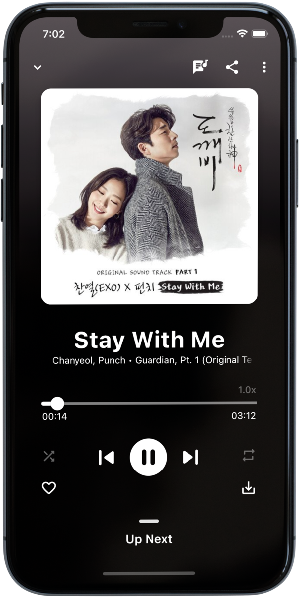

# Oryn

A elegent, immersive music experience. No Ads. No distractions. Just sound.

[](https://flutter.dev/)   [](https://github.com/I-Am-Saksham-Srivastavaa/BlackHoleReimagined/actions/workflows/flutter.yml) [](https://hosted.weblate.org/engage/blackhole/)

### Don't forget to :star: the repo

[](https://github.com/I-Am-Saksham-Srivastavaa/BlackHoleReimagined/stargazers)  

## Download

[](https://I-Am-Saksham-Srivastavaa.github.io/download/) [](https://github.com/I-Am-Saksham-Srivastavaa/BlackHoleReimagined/releases) [](https://t.me/blackhole_official) [](https://f-droid.org/packages/com.infinity.oryn/) [](https://android.izzysoft.de/repo/apk/com.infinity.oryn)

## Translations

- [Turkish :tr:](/README.TR.md)
- [Spanish :es:](/README.ES.md)
- [Russian :ru:](/README.RU.md)
- [French :fr:](/README.FR.md)
- [Portuguese :brazil:](/README.PT.md)
- [Japanese :jp:](/README.JA.md)
- [Belarusian :belarus:](/README.BE.md)
- [Indonesian :indonesia:](/README.ID.md)

## Features

- High Streaming Quality (320kbps AAC)
- Song, Album, Artist and Playlist Search
- Language Specific Promoted Playlists
- Trending Songs
- Artist and Genre Radios
- Support 15+ music languages
- Local and Global Top Spotify songs
- Add Songs to Favorite
- Playlists support
- Import Playlists from Spotify & YouTube
- Import/Export Playlists as JSON File
- Share Playlists
- Sleep timer
- Lyrics Support
- Queue Management
- Listening history record
- Dark mode / accent color
- Custom Gradients and other Theme options
- Supports Portrait as well as Landscape mode
- Download for offline play (320kbps with ID3 tags)
- Play Online as well as Offline Songs
- Tag Editing Support
- Trending Search Results
- YouTube Search Support
- Promoted Youtube Playlists
- Play videos as audio
- Auto Song Recommendations
- Inbuilt Equalizer
- Backup & Restore
- Auto Update Check
- Cache support
- No Subscription
- No Ads

and much more...
Check it yourself :)

     

## Building from Source

1. If you don't have Flutter SDK installed, please visit official [Flutter](https://flutter.dev/) site.
2. Fetch latest source code from master branch.

```bash
git clone https://github.com/I-Am-Saksham-Srivastavaa/BlackHoleReimagined.git
```

3. Run the app with Android Studio or VS Code. Or the command line:

```bash
flutter pub get
flutter run
```

## Contribute

Contributions are welcome. Please read our [contributing guidelines](https://github.com/I-Am-Saksham-Srivastavaa/BlackHoleReimagined/blob/main/CONTRIBUTING.md) before contributing.

## Facing any Issue?

Have a look at some [common Issues](https://github.com/I-Am-Saksham-Srivastavaa/BlackHoleReimagined/wiki/Common-Issues) that you might face. If your problem is not there, feel free to open an Issue :)

## Want to test Beta Versions? Need help??

You can join our [Telegram Channel](https://t.me/blackhole_official) or [Telegram Group](https://t.me/), if you have any query, or need help with something as well as to get beta updates of the project.

## What's New

To read full changelog visit the [wiki page](https://github.com/I-Am-Saksham-Srivastavaa/BlackHoleReimagined/wiki/Changelog)

## License

```text
Copyright © 2021 Saksham Srivastava

BlackHole is a free software licensed under GPL v3.0
It is distributed in the hope that it will be useful, but WITHOUT ANY WARRANTY;
without even the implied warranty of MERCHANTABILITY or FITNESS FOR A PARTICULAR PURPOSE.
```

```text
Being Open Source doesn't mean you can just make a copy of the app and upload it on playstore or sell
a closed source copy of the same.
Read the following carefully:
1. Any copy of a software under GPL must be under same license. So you can't upload the app on a closed source
  app repository like PlayStore/AppStore without distributing the source code.
2. You can't sell any copied/modified version of the app under any "non-free" license.
   You must provide the copy with the original software or with instructions on how to obtain original software,
   should clearly state all changes, should clearly disclose full source code, should include same license
   and all copyrights should be retained.

In simple words, You can ONLY use the source code of this app for `Open Source` Project under `GPL v3.0` or later
with all your source code CLEARLY DISCLOSED on any code hosting platform like GitHub, with clear INSTRUCTIONS on
how to obtain the original software, should clearly STATE ALL CHANGES made and should RETAIN all copyrights.
Use of this software under any "non-free" license is NOT permitted.
```

See the [GNU General Public License](https://github.com/I-Am-Saksham-Srivastavaa/BlackHole/blob/main/LICENSE) for more details.

## Disclaimer

```text
BlackHole does not own or have any affiliation with the songs and other content available through the app.
All songs and other content are the property of their respective owners and are protected by copyright law.
BlackHole is not responsible for any infringement of copyright or other intellectual property rights that may result
from the use of the songs and other content available through the app. BlackHole uses third-party plugins and
is not responsible for any harm or damage to the respective owners or any other parties resulting from the use
of the songs and other content through the third-party plugins.
By using the app, you agree to use the songs and other content only for personal, non-commercial purposes
and in compliance with all applicable laws and regulations.
```

## Liked my work?

<a href="https://www.buymeacoffee.com/" target="_blank"></a>
