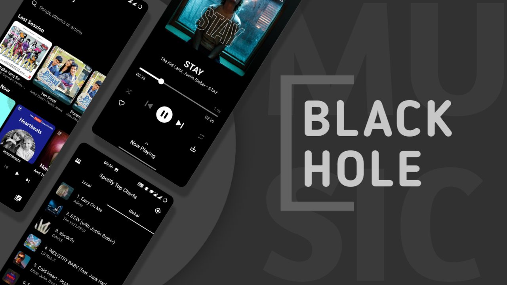
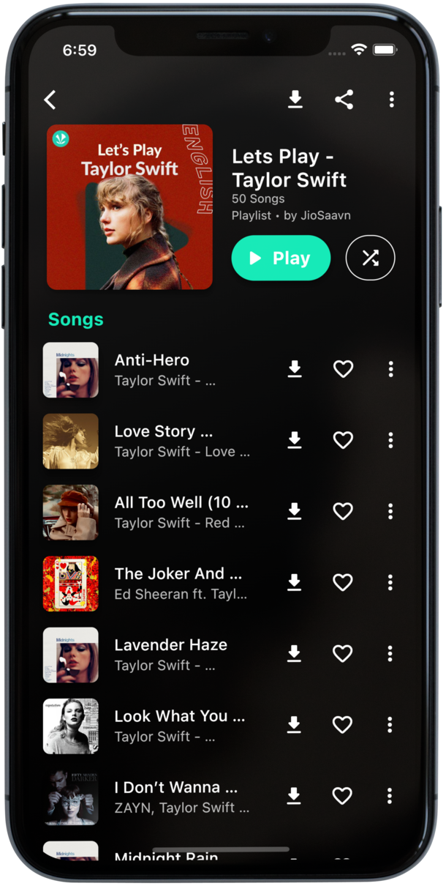

# Oryn

एक सुरुचिपूर्ण, इमर्सिव संगीत अनुभव। कोई विज्ञापन नहीं। कोई व्याकुलता नहीं। केवल ध्वनि।

[](https://flutter.dev/)   [](https://github.com/I-Am-Saksham-Srivastavaa/BlackHoleReimagined/actions)

### कृपया इस रेपो को :star: करें

[](https://github.com/I-Am-Saksham-Srivastavaa/BlackHoleReimagined/stargazers)

## डाउनलोड करें

[](https://I-Am-Saksham-Srivastavaa.github.io/download/) [](https://github.com/I-Am-Saksham-Srivastavaa/BlackHoleReimagined/releases)

## अनुवाद

- [तुर्की :tr:](/README.TR.md)
- [स्पेनिश :es:](/README.ES.md)
- [रूसी :ru:](/README.RU.md)
- [फ्रेंच :fr:](/README.FR.md)
- [पुर्तगाली :brazil:](/README.PT.md)
- [जापानी :jp:](/README.JA.md)
- [बेलारूसी :belarus:](/README.BE.md)
- [इंडोनेशियाई :indonesia:](/README.ID.md)

## विशेषताएँ

- उच्च स्ट्रीमिंग गुणवत्ता (320kbps AAC)
- गाने, एल्बम, कलाकार और प्लेलिस्ट खोजें
- भाषा विशिष्ट प्रचारित प्लेलिस्ट
- ट्रेंडिंग गाने
- कलाकार और शैली रेडियो
- 15+ संगीत भाषाओं का समर्थन
- स्थानीय और वैश्विक शीर्ष Spotify गाने
- गाने पसंदीदा में जोड़ें
- प्लेलिस्ट समर्थन
- Spotify और YouTube से प्लेलिस्ट आयात करें
- JSON फ़ाइल के रूप में प्लेलिस्ट आयात/निर्यात करें
- प्लेलिस्ट साझा करें
- स्लीप टाइमर
- गीत समर्थन
- कतार प्रबंधन
- सुनने का इतिहास रिकॉर्ड करें
- डार्क मोड / एक्सेंट रंग
- कस्टम ग्रेडिएंट्स और अन्य थीम विकल्प
- पोर्ट्रेट और लैंडस्केप मोड दोनों का समर्थन करता है
- ऑफ़लाइन खेलने के लिए डाउनलोड करें (320kbps के साथ ID3 टैग)
- ऑनलाइन और ऑफ़लाइन गाने चलाएं
- टैग संपादन समर्थन
- ट्रेंडिंग खोज परिणाम
- YouTube खोज समर्थन
- प्रचारित YouTube प्लेलिस्ट
- वीडियो को ऑडियो के रूप में चलाएं
- स्वचालित गाना अनुशंसाएँ
- इनबिल्ट इक्वलाइज़र
- बैकअप और पुनर्स्थापना
- स्वचालित अपडेट जांचें
- कैश समर्थन करता है
- कोई सदस्यता नहीं है
- कोई विज्ञापन नहीं है

     

## स्रोत से निर्माण

1. यदि आपके पास Flutter SDK स्थापित नहीं है, तो कृपया आधिकारिक [Flutter](https://flutter.dev/) साइट पर जाएँ।
2. मास्टर शाखा से नवीनतम स्रोत कोड लाएं

```bash
git clone https://github.com/I-Am-Saksham-Srivastavaa/BlackHoleReimagined.git
cd BlackHole
flutter pub get
```
3. एप्लिकेशन चलाएँ

```bash
flutter run
```

## योगदान करें

योगदान का स्वागत है। कृपया योगदान करने से पहले हमारे [योगदान दिशानिर्देश](https://github.com/I-Am-Saksham-Srivastavaa/BlackHoleReimagined/blob/main/CONTRIBUTING.md) पढ़ें।

## कोई समस्या आ रही है?

आप कुछ [सामान्य समस्याओं](https://github.com/I-Am-Saksham-Srivastavaa/BlackHoleReimagined/blob/main/FAQ.md) की जांच कर सकते हैं।

## बीटा संस्करण का परीक्षण करना चाहते हैं? मदद चाहिए?

आप हमारे [टेलीग्राम चैनल](https://t.me/blackhole_official) या [टेलीग्राम समूह](https://t.me/) में शामिल हो सकते हैं, यदि आपके पास कोई प्रश्न है, या किसी चीज़ में मदद चाहिए, साथ ही प्रोजेक्ट के बीटा अपडेट प्राप्त करने के लिए।

## क्या नया है

पूर्ण चेंजलॉग पढ़ने के लिए [विकि पृष्ठ](https://github.com/I-Am-Saksham-Srivastavaa/BlackHoleReimagined/blob/main/CHANGELOG.md) पर जाएँ।

## लाइसेंस

```text
Copyright © 2021 Saksham Srivastava

BlackHole is a free software licensed under GPL v3.0
It is distributed in the hope that it will be useful, but WITHOUT ANY WARRANTY;
without even the implied warranty of MERCHANTABILITY or FITNESS FOR A PARTICULAR PURPOSE.
```

```text
Being Open Source doesn't mean you can just make a copy of the app and upload it on playstore or sell
a closed source copy of the same.
Read the following carefully:
1. Any copy of a software under GPL must be under same license. So you can't upload the app on a closed source
  app repository like PlayStore/AppStore without distributing the source code.
2. You can't sell any copied/modified version of the app under any "non-free" license.
   You must provide the copy with the original software or with instructions on how to obtain original software,
   should clearly state all changes, should clearly disclose full source code, should include same license
   and all copyrights should be retained.

In simple words, You can ONLY use the source code of this app for `Open Source` Project under `GPL v3.0` or later
with all your source code CLEARLY DISCLOSED on any code hosting platform like GitHub, with clear INSTRUCTIONS on
how to obtain the original software, should clearly STATE ALL CHANGES made and should RETAIN all copyrights.
Use of this software under any "non-free" license is NOT permitted.
```

See the [GNU General Public License](https://github.com/I-Am-Saksham-Srivastavaa/BlackHole/blob/main/LICENSE) for more details.

## अस्वीकरण

```text
BlackHole गानों और ऐप के माध्यम से उपलब्ध अन्य सामग्री का मालिक नहीं है और न ही उनका कोई संबंध है।
सभी गाने और अन्य सामग्री उनके संबंधित मालिकों की संपत्ति हैं और कॉपीराइट कानून द्वारा संरक्षित हैं।
BlackHole गानों और ऐप के माध्यम से उपलब्ध अन्य सामग्री के उपयोग से उत्पन्न होने वाले कॉपीराइट या अन्य बौद्धिक संपदा अधिकारों के किसी भी उल्लंघन के लिए जिम्मेदार नहीं है।
BlackHole तृतीय-पक्ष प्लगइन्स का उपयोग करता है और गानों और तृतीय-पक्ष प्लगइन्स के माध्यम से उपलब्ध अन्य सामग्री के उपयोग से संबंधित मालिकों या अन्य पक्षों को होने वाले किसी भी नुकसान या क्षति के लिए जिम्मेदार नहीं है।
ऐप का उपयोग करके, आप गानों और अन्य सामग्री का उपयोग केवल व्यक्तिगत, गैर-व्यावसायिक उद्देश्यों के लिए और सभी लागू कानूनों और विनियमों के अनुपालन में करने के लिए सहमत होते हैं।
```

## मेरा काम पसंद आया?

<a href="https://www.buymeacoffee.com/" target="_blank"></a>

